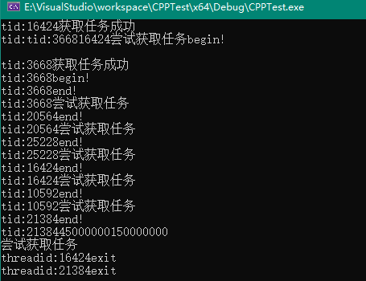
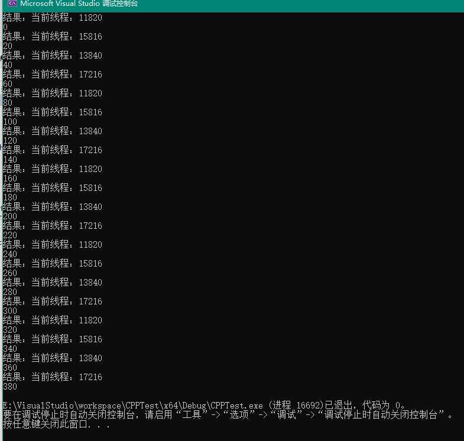

# ThreadPool

## 介绍

方式一：MyThreadPool

方式二：MyNewThreadPool（推荐，简洁）

## 测试

方式一：MyThreadPool



方式二：MyNewThreadPool



## 参考

```c++
https://www.bilibili.com/video/BV1Fb421H7ep
https://www.bilibili.com/video/BV1wmpoemEG5
```

# End

